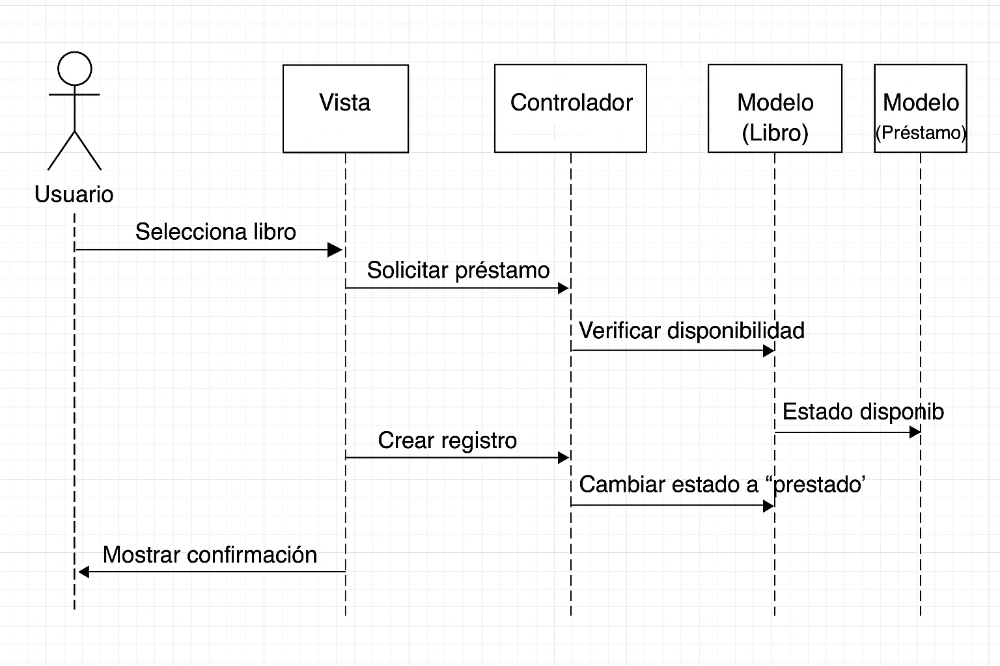

## Biblioteca

```shell
Resumen del Diagrama de Clases

Clase Usuario

Atributos:

id: identificador único del usuario.

nombre: nombre del usuario.

email: correo electrónico.

password: contraseña.

rol: tipo de usuario (por ejemplo, administrador o lector).

Métodos:

registrar(): permite crear un nuevo usuario en el sistema.

autenticar(): valida las credenciales para iniciar sesión.

Clase Libro

Atributos:

id: identificador único del libro.

titulo: nombre del libro.

autor: autor del libro.

disponible: indica si el libro está disponible o prestado.

Método:

cambioEstado(): cambia el estado de disponibilidad del libro (por ejemplo, al ser prestado o devuelto).

Clase Préstamo

Atributos:

id: identificador único del préstamo.

usuario_id: referencia al usuario que realiza el préstamo.

libro_id: referencia al libro prestado.

fecha_inicio: fecha en que comienza el préstamo.

fecha_fin: fecha en que finaliza el préstamo.

Métodos:

registrar(): crea un nuevo préstamo.

finalizar(): marca el préstamo como finalizado y actualiza el estado del libro.

```
Relaciones:

Un Usuario puede tener uno o varios Préstamos.

Un Libro puede estar asociado a cero o un Préstamo activo.

La clase Préstamo actúa como intermediaria entre Usuario y Libro.




Cambiar el rol:

```shell
$ python manage.py shell
# y ahora:

from catalog.models import Usuario

# Buscar el usuario por nombre
user = Usuario.objects.get(username="nombre_del_usuario")

# Cambiar el rol
user.rol = "admin"

# (opcional) darle permisos de staff y superuser
user.is_staff = True
user.is_superuser = True

user.save()
print("Rol actualizado correctamente:", user.rol)
```

Poblar la db:
```shell
$ pip install Faker
$ python manage.py shell
from faker import Faker
from catalog.models import Usuario

fake = Faker()

# Ejemplo: crear 10 usuarios falsos con rol lector
for _ in range(10):
    Usuario.objects.create(
        nombre=fake.name(),
        correo=fake.email(),
        rol='lector',
        password='123456'
    )

print("Usuarios creados con éxito.")

```


